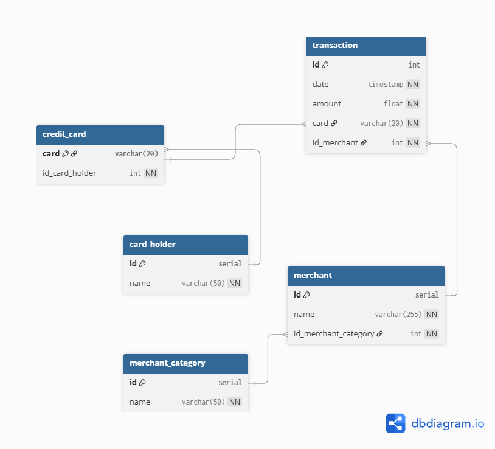

# Credit Card Fraud Detection 
Dataset Source: https://github.com/maitree7/Fraud_Detection_SQL

## Data Modelling
To better understand the schema of the files, DBDiagram.io was used to construct an ER Diagram and visualize the relationship between tables. 

<p align="center">
  
</p>

## Data Analysis
Transactions are flagged as suspicious if it is either **high-value transactions (over $1000)** during the late-night to early morning hours or **repeating low-value value transactions (under $2).** The following data analysis was taken. 
 
### Suspicious High-Value Transactions

Suspicious high-value transactions are defined as:
- **Time-based anomaly**: Transaction was made during suspicious hours (11PM - 5AM)
- **Amount-based anomaly**: Transaction with amounts greater than (mean + 2 × standard deviation) of their merchant category

The following cards that match this descriptions are flagged as suspicious high-value transactions.
```
WITH category_stats AS (
    SELECT 
        c.id AS category_id,
        AVG(t.amount) AS mean_amount,
        STDDEV(t.amount) AS std_amount
    FROM transaction t
    JOIN merchant m ON t.id_merchant = m.id
    JOIN merchant_category c ON m.id_merchant_category = c.id
    GROUP BY c.id
)
SELECT 
    cc.id_card_holder
FROM transaction t
JOIN merchant m ON t.id_merchant = m.id
JOIN merchant_category c ON m.id_merchant_category = c.id
JOIN category_stats cs ON c.id = cs.category_id
JOIN credit_card cc ON t.card = cc.card
WHERE 
    (
        EXTRACT(HOUR FROM t.date) >= 23 OR 
        EXTRACT(HOUR FROM t.date) < 5
    )
    AND t.amount > (cs.mean_amount + 2 * cs.std_amount)
ORDER BY t.amount DESC;

```
The plot below shows the transactions over time, flagging high-value transactions.

<p align="center">
  
</p>

### Repeating Low-Value Transactions
Another potential  fraud strategy involves making several low-value transactions as these are often overlooked by cardholders. Repeating low-value transactions can be defined as credit cards charges under $2 that reoccur more than X times. To find that threshold, IsolationForest was applied.

The id and number of low-value transactions (transactins under $2) were first filtered out. 
```
SELECT 
    cc.id_card_holder, 
    COUNT(t.date) AS low_value_transaction
FROM 
    credit_card AS cc
LEFT JOIN 
    transaction AS t
    ON cc.card = t.card
WHERE 
    t.amount < 2
GROUP BY 
    cc.id_card_holder
ORDER BY 
    cc.id_card_holder ASC;
```


## Predictive Modelling
